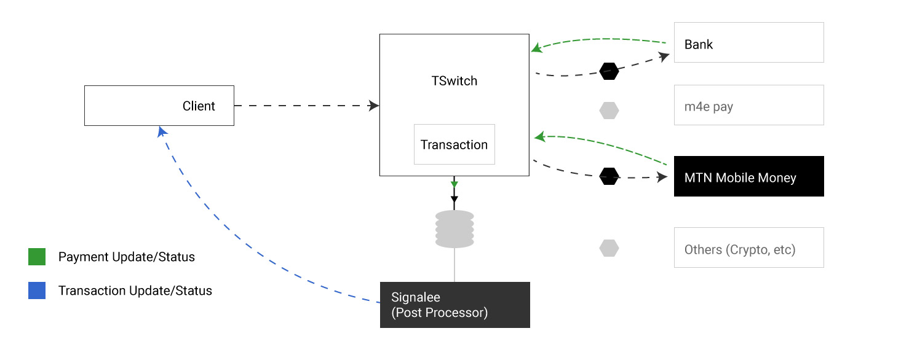

Introduction
*****************

Payments made with the m4e system is completed using the m4e switch (call it the TSwitch). The TSwitch is responsible for taking a uniform payment form and completing the transaction with a specified payment provider (see :doc:`payment_providers`).

Note on keywords **(payment and transactions)**: Payments is the transfer of money from one wallet to another. Transactions hold the progress (success or failure) of a payment process. Thus transactions are records of payments.

The figure below demonstrates a basic overview of payment processing on m4e

    Figure1: Payment processing overview

Agents
---------

From the figure above we can derive the following agents involved in a payment transaction.

* Client
* Payment Switch (TSwitch)
* Payment Provider
* Signalee

Client
^^^^^^^^^^
The client is the agent that initiates the payment process. The m4e system *(or specifically the TSwitch)* is agnostic of the client. Therefore the client can be an external server, the m4e payment SDK, a POS device, etc. To begin payment process *(or create a transaction)* the client needs to provide the following form data:

.. code-block:: javascript

    {
        transactionId: "", // uuid 
    }

